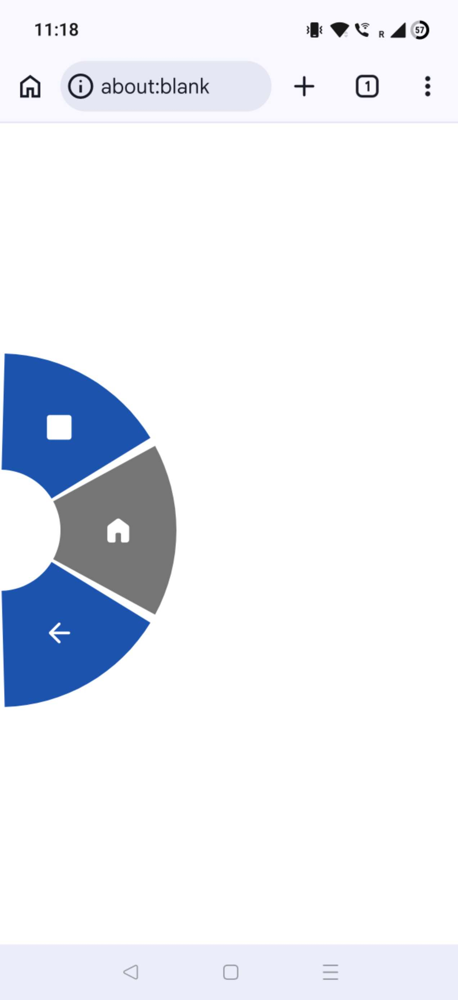

# Pie Launcher

[](app/build.gradle.kts)
[](LICENSE)
[](https://www.paypal.com/donate/?business=HC9A86GXJZ58S&no_recurring=0&currency_code=USD)
[](https://etherscan.io/address/0xea115154408b1a3939678adf5a5ab5b8b15dcb11)
[](https://www.blockchain.com/btc/address/14DremGQ8NiVjrxXBAfqghdrjSWaiFXB9h)

An original, optimized, and root-capable radial **PIE gesture launcher** for Android.
Swipe in from a screen edge to open a half-donut pie menu, drag to a slice, and lift to
fire an app or a system/root action. Portions of this code feature vibe coding from popular
LLMs.

> Package: `com.kj2431.pielauncher` · minSdk 26 · targetSdk 35 · Kotlin



## Inspiration

This project deeply was inspired by **LMT Launcher** by noname81
([XDA thread](https://xdaforums.com/t/app-root-lmt-launcher-v3-2.1330150/)),
a pioneering PIE/gesture control APP for rooted Android devices. Originally released
over 10 years ago, as a heavy user of LMT Launcher, I have realized that it has not
been updated for modern Android releases, and there have been bugs over the years.

Pie Launcher modernizes the concept for Android 15 and 16 — with full edge-to-edge
display support, Material You dynamic color, Material 3 Expressive icons, the
modern overlay and foreground-service APIs, and a persistent root shell that works
reliably with current superuser managers like Magisk. It is an independent
reimplementation built from scratch; no code or assets from LMT are included or
redistributed.

## Features

- **Edge activation strips** on any combination of Left / Right / Top / Bottom.
- **Center-point placement**: choose where along the edge the activation area is
  centered, and a separate length to grow/shrink it.
- **Half-donut PIE** that fans inward from the edge, opening in place with a
  time-based ease-out animation. Slice ordering is consistent per edge.
- **Short- and long-press per slice**: a long-press swaps the slice face to the
  long action's own icon/label before it fires.
- **~30 actions** (Home, Back, Recents, Notifications, Quick Settings, screen
  lock, Wi-Fi / Bluetooth / data toggles, screenshot, split-screen, launch app,
  open URL, run shell script, and more) via Accessibility and/or root.
- **Material 3 Expressive icons** — authentic Material Symbols (Rounded, filled).
- **Three configurable PIE colors**: resting background, click highlight, and
  long-press highlight. Defaults are derived from the device's Material You
  palette (the darkest of three system colors becomes the resting background).
- **Theme**: System / Light / Dark / AMOLED black, with status- and navigation-
  bar icon contrast handled automatically.
- **Single persistent root shell** — root is requested once at activation and
  reused, so the superuser manager doesn't prompt on every command.
- Optional **AccessibilityService** for non-root global actions, and a boot
  receiver to restart the service after reboot.

## Build

Requires JDK 17 and the Android SDK (compile SDK 35).

```bash
# Debug
./gradlew assembleDebug
# -> app/build/outputs/apk/debug/app-debug.apk

# Release (signed - see "Release signing" below)
./gradlew assembleRelease
# -> app/build/outputs/apk/release/app-release.apk
```

Point the build at your SDK by either setting `ANDROID_HOME` / `ANDROID_SDK_ROOT`
or creating `local.properties` with `sdk.dir=/path/to/Android/sdk`.
(`local.properties` is git-ignored.)

## Release signing

Signing credentials are read from a **git-ignored** `keystore.properties` at the
repo root, so no secrets live in version control. To set it up:

1. Create a keystore (once) and **back it up safely** — losing it means you can
   no longer ship updates under the same app identity:

   ```bash
   keytool -genkeypair -v \
     -keystore pielauncher-release.keystore \
     -alias pielauncher -keyalg RSA -keysize 2048 -validity 10000
   ```

2. Create `keystore.properties` next to `settings.gradle.kts`:

   ```properties
   storeFile=pielauncher-release.keystore
   storePassword=YOUR_STORE_PASSWORD
   keyAlias=pielauncher
   keyPassword=YOUR_KEY_PASSWORD
   ```

3. Build: `./gradlew assembleRelease`. If `keystore.properties` is absent, the
   release build runs without the release signing config (debug builds are
   unaffected).

Both `keystore.properties` and `*.keystore` / `*.jks` are listed in `.gitignore`.

## Permissions

`SYSTEM_ALERT_WINDOW` (the overlay), `FOREGROUND_SERVICE` (+ special use),
`POST_NOTIFICATIONS`, `RECEIVE_BOOT_COMPLETED`, and `VIBRATE`. Root actions use
`su` only through the isolated `RootHelper`; the AccessibilityService performs
global actions only and reads no screen content.

## Project layout

```
app/src/main/java/com/kj2431/pielauncher/
  service/   overlay service, accessibility service, boot receiver
  view/      PieEdgeView (donut renderer + gesture handling)
  action/    action catalog + runner (none / accessibility / root)
  root/      RootHelper (single persistent su shell)
  model/     PieItem, AppInfo
  prefs/     Prefs (SharedPreferences source of truth)
  ui/        edge-to-edge + theme helpers
  *Activity  control surface, settings, PIE/app/command pickers
```

## Support / donate

If this is useful to you and you'd like to support development:

**[Donate via PayPal](https://www.paypal.com/donate/?business=HC9A86GXJZ58S&no_recurring=0&currency_code=USD)**

Crypto:

- **ETH:** `0xea115154408b1a3939678adf5a5ab5b8b15dcb11`
- **BTC:** `14DremGQ8NiVjrxXBAfqghdrjSWaiFXB9h`

## License

Copyright 2026 kj2431

Licensed under the **Apache License, Version 2.0** (the "License"); you may not
use this software except in compliance with the License. You may obtain a copy
of the License at:

> <https://www.apache.org/licenses/LICENSE-2.0>

Unless required by applicable law or agreed to in writing, software distributed
under the License is distributed on an "AS IS" BASIS, WITHOUT WARRANTIES OR
CONDITIONS OF ANY KIND, either express or implied. See the License for the
specific language governing permissions and limitations under the License.

See [LICENSE](LICENSE) for the full license text.

PIE menu icons are [Material Symbols](https://fonts.google.com/icons) by Google,
also licensed under the Apache License 2.0 (see [NOTICE](NOTICE)).
